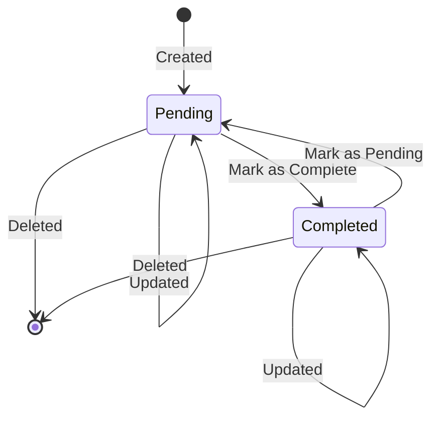

# Data Model: Phase I - Core Todo Essentials

## Entities

### Task
Represents a single todo item in the system.

| Field | Type | Description | Validation |
|-------|------|-------------|------------|
| `id` | `int` | Unique identifier (auto-increment) | > 0, Unique |
| `title` | `str` | Short summary of the task | Required, 1-100 chars |
| `description`| `str` | Optional detailed notes | Max 500 chars |
| `status` | `str` | "Pending" or "Completed" | Must be one of the two |

## State Transitions

## Validation Rules

1. **Title**: Cannot be empty or purely whitespace.
2. **ID**: Must exist in the current session for update/delete/complete operations.
3. **Status**: Defaults to "Pending" on creation.
